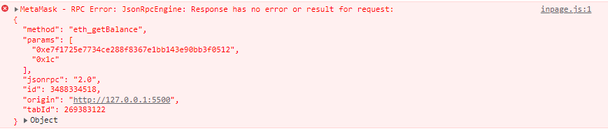
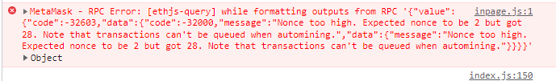

# FundMe FRONTEND 🚀🚀🚀

This project Provides Graphical User Interface (GUI) for FundMe Hardhat Project. Users can Interact with FundMe Smart Contract through a Graphical Interface at Most Abstract Level.

-   1. Clone the BACKEND from [here](https://github.com/theirrationalone/FundMe-hardhat.git), Using git clone command.

        - After Cloning Backend, Try running this command on terminal of your backend. Keep that process running initiated by command below.

        ```shell
        npx hardhat node
        ```

*   2. Come back here on FRONTEND, install 'Live Server' Extension if You are using vs-code or You can install an npm library. If you don't have any idea about that npm libraries/packages, Try running command given below, after that type http-server on terminal and hit enter then follow instructions just appeared on Terminal.

    ```shell
    npm install -g http-server
    ```

*   3. Boooom Now you can Interact with FundMe Smart Contract Graphically.
       <br/>
       <br/>
       <br/>
*   4. If You are facing this kind of Error: 
       <br />
       <br />

*   -   -   # Possible Issue

*   -   -   -   Your Backend might gone down, Mitigation: Try restarting Your backend.

<br />
<br />
<br />

-   5. If You are facing this kind of Error:<br/>
       <br />
       <br />

*   -   -   # Possible Issue

*   -   -   -   Due to multiple Transaction Failure during backend's back to back up and down state walks, Transaction count gone mismatched, all you need is to reset your metamask.
                <br />
                <br />
                
                <br />
                <br />
                
                <br />
                <br />
                
                <br />
                <br />

# Thank You! :) 🏴‍☠️
